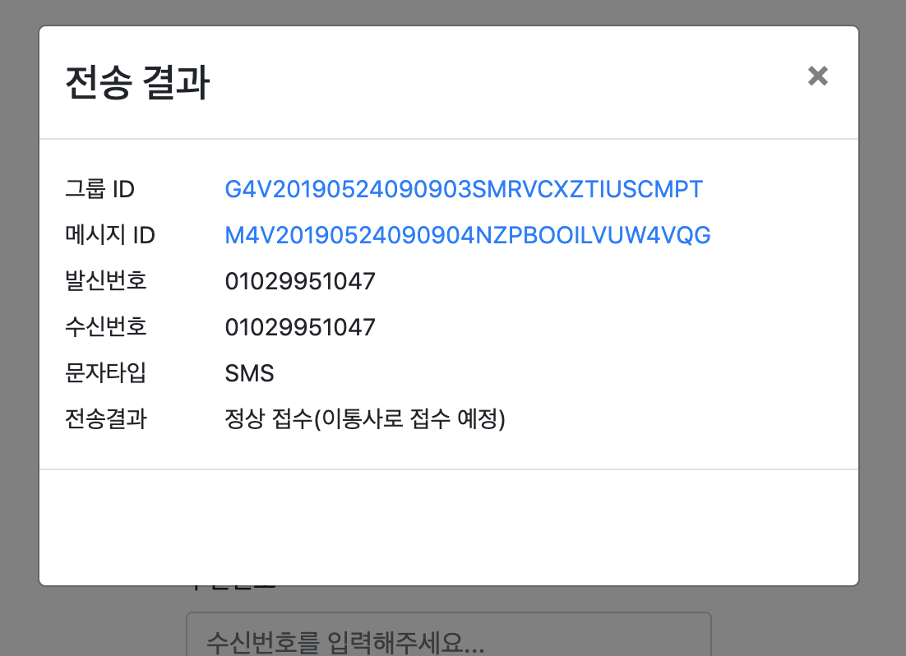

# simpleMessage

# 🛑 현재 해당 예제/소프트웨어는 유지보수가 중단되었습니다!

[Solapi OAuth2](https://docs.solapi.com/authentication/oauth2), [Node js](https://nodejs.org/ko/), [Express](https://expressjs.com/ko/)로 만들어진 문자메시지 발송이 가능한 웹앱입니다.

## 사용법

#### npm 설치
`npm install`

#### 서버 실행
`npm start`
